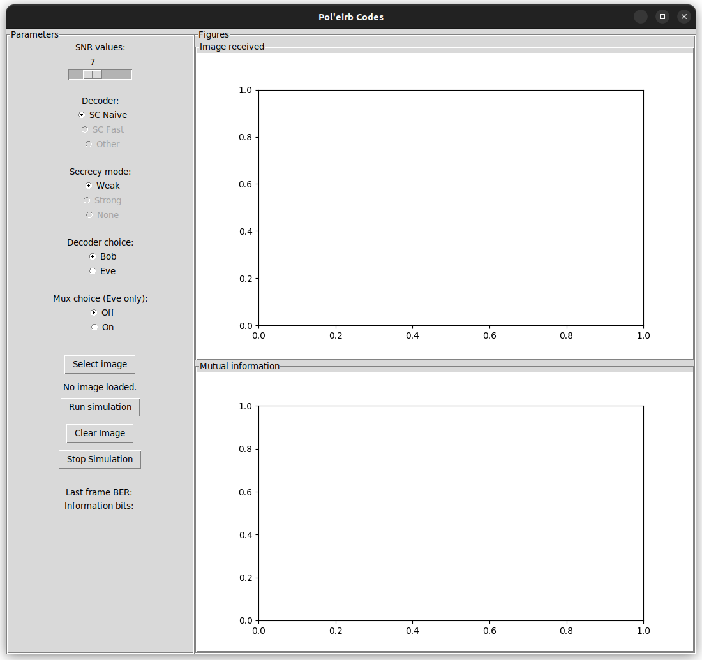
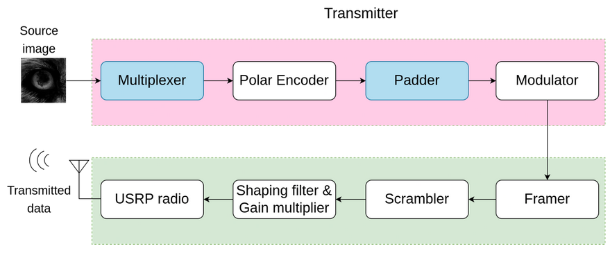
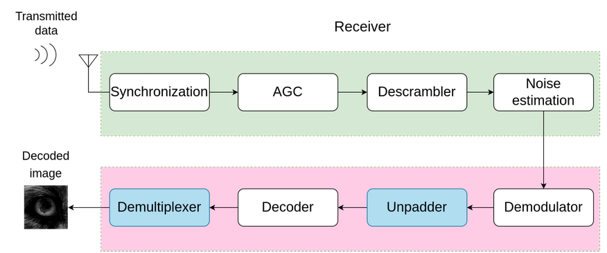

## Pol'Eirb Codes

An example of polar codes usage for secrecy. Based on [1] and built using [py_aff3ct](https://github.com/aff3ct/py_aff3ct)

___________

### Table of Contents

[**Pol'Eirb Codes Overview**    ](#overview) 

[**Installation**](#install)

[**How to use**](#usage)
- [Virtual demonstrator](#virtual)
- [Radios demonstrator](#radios)
- [Limits of the Radios Demonstrator](#not_implemented)
___________

<a name="overview"/>

### Overview of the Project

This project's aim is to implement a form of secrecy using the polarization properties of polar codes.

It focuses on the "*weak secrecy*"-related chapters in [1] and tries to implement it in a communication chain using [`Aff3ct`](https://github.com/aff3ct/aff3ct) modules.

The following Figure illustrates the problem.


In this situation, Eve is an eavesdropper and tries to intercept the communication between Alice and Bob. Due to being either physically further away, or having an obstacle in the way, she will receive the signal with a degradation. This project makes use of this degradation to try and make the communication secure.

In a nutshell, weak secrecy uses the fact that polar codes make some bits very easy to decode and others very hard to decode to communicate only on the hardest to decode bits and drown the information in a random signal.

A complete overview of the project can be found [here](report.pdf).

___________
<a name="install"/>

### Installation

**Dependencies**

- [py_aff3ct](https://github.com/aff3ct/py_aff3ct)

- [pyaf](https://github.com/rtajan/pyaf)

And their respective dependencies.

**Compile the pyaf modules**

- Drag and drop the different modules `Multiplexer`, `Padder`, `Splitter` and `MutualInformation` from the `src` folder to your `pyaf/src/cpp/Modules` folder.
- Replace the folder `pyaf/src/cpp/Wrapper` with `src/Wrapper`
- Recompile the library with the following commands
```bash
$ cd pyaf/build
$ cmake .. -G"Unix Makefiles" -DCMAKE_BUILD_TYPE=Release -DCMAKE_CXX_FLAGS="-Wall -funroll-loops -march=native -fvisibility=hidden -fvisibility-inlines-hidden -faligned-new"
$ make -j4
```

**Install the Python libraries**

First install the required Python modules.

***For Pip:***

```bash
$ pip install -r requirements.txt
```

***For Conda:***

```bash
$ conda install --file requirements.txt
```

**Setup your environment**

In order to work with different *py_aff3ct* installs, the *dotenv* library was used to track the install path of the used libraries.

First, create a *.env* file at the root of the cloned repository. Inside, write

```bash
AFF3CT_PATH=... # replace ... with the path to your folder py_aff3ct/build/lib
PYAF_PATH=...   # replace ... with the path to your folder pyaf/build/lib
THREADED_PATH=... # replace ... with the path to your folder pyaf/src/python
```

___________
<a name="usage"/>

### How to Use

Three codes are given in this repository. One is made for simulations without radios. Two are made to demonstrate the weak secrecy using physical radios.
The Python scripts given in the `src/` folder were used during the project development but should **not** be executed manually. There is a non-zero probability that they might be broken.

<a name="virtual"/>

#### Virtual demonstrator

The virutal demonstrator can be accessed via the `interace/` folder. It consists of a user interface which is used to modify the parameters of the simulations, and the code to build and run the communication chain.

An image has to be given to the interface before running the code. Grayed out buttons correpond to unimplemented features.

Running the command

```bash
$ python3 interface/interface.py
```

prompts the following graphical interface.



On the top right hand corner will be displayed the received image, whereas on the bottom right hand corner, the mutual information between the transmitter and the receiver is plotted.

The left part of the interface is allocated to the parameters and some informations about the communication, like the *Binary Error Rate* (BER) or the number of bits used for the communication.

This script implements the bare bones of the weak secrecy. The implemented communication chain is the following.


<a name="radios"/>

#### Radios demonstrator

**Disclaimer:** The latest version of this code has not been tested with the radios. There may be some bugs remaining that will crash the program. If so, please feel free to open an issue on github so we may help you fix it.

Some functionalities also were not fully implemented in the radios demonstrator. Please refer to [this](#not-implemented) section to know what *may* happen which is not a bug.

Two scripts are used for the radios demonstrator. One for the transmitter Tx, and one for the receiver Rx.
By default, they are configured to be used with USRP-B100 radios, using the DVB-S2 standard of communication.

The transmitter can be run using 

```bash
$ python3 TX/tx_final.py
```

This prompts a user interface similar to the previous one, but without the statistics. It can be used to load an image and broadcast it via the radio. The implemented communication chain is the following.



The receiver can be run using

```bash
$ python3 RX/RX_interface.py
```

This script receives data from the USRP-B100 radio n times a second and displays both the scatterplot received and the image as it is received. The implemented communication chain is the following.



<a name="not_implemented"/>

#### Limits of the Radios Demonstrator

This project lasted only three months, leaving some ideas partially or not implemented. If you use the radio demonstrator as is, these might happen to you.

- **Synchronize both Splitter modules**: The Splitter module of the transmitter and the receiver are not synchronized. This leads to the receiver buffering the image starting from the middle instead of the beginning.
- **Random noises appearing**: When experimenting with the radios, we observed that every 50 pixels of an image was replaced with a random value. This never happened without the radios, and we could not find the issue in time.
- **Compatibility between radios and interface**: When running the transmitter or the receiver's code with a tkinter gui, the script gets stuck in the transmission/reception loop and never gives back control to the gui.
- **Not up to date**: The last additions to the virtual version of the demonstrator (namely, the possibility for Eve to possess or not the demultiplexer) have not been added to the radios version, due to the impossibility to test it in time.

**References**

[1] TALEB Khaled, *Physical layer security : Wiretap polar codes for secure communications*, 2022
